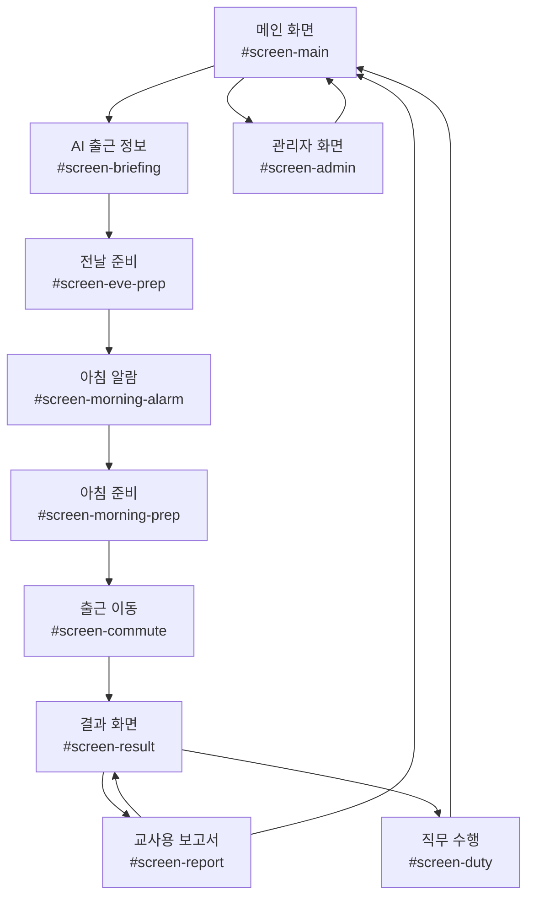
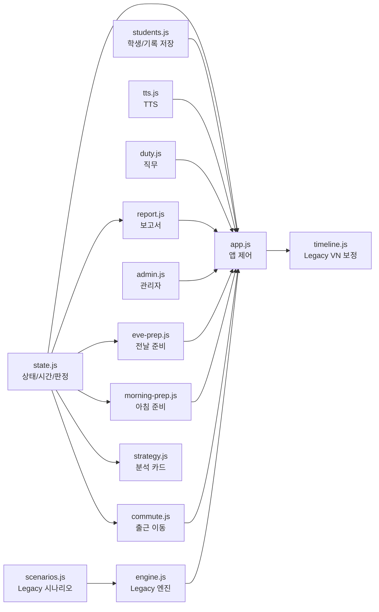

# 본앤하이리 출근 마스터 프로젝트 아키텍처 문서

작성일: 2026-06-17  
분석 기준: 현재 저장소의 `index.html`, `css/style.css`, `css/wide_vn.css`, `js/*.js` 실제 구조

> 이 문서는 기능 추가나 디자인 수정을 하지 않고, 현재 프로젝트의 화면 흐름, 상태 구조, 파일 역할, Legacy 코드 후보를 정리한 아키텍처 문서입니다.

## 1. 전체 화면 흐름도(Screen Flow)

현재 기본 플레이 흐름은 아래와 같습니다.



### 실제 기본 흐름

1. `#screen-main`
   - 학생 선택
   - `출근 준비 시작` 클릭

2. `#screen-briefing`
   - AI 출근 정보 생성 결과 확인
   - 출근 시간, 날씨, 직무, 준비물 확인

3. `#screen-eve-prep`
   - 버스 시간 확인
   - 전날 가방 준비
   - 잠자기 연출
   - 알람 설정

4. `#screen-morning-alarm`
   - 알람 울림
   - 바로 일어나기 또는 10분 더 자기

5. `#screen-morning-prep`
   - 아침 행동 선택
   - 가방 확인
   - 시간/버스/예상 도착 판단
   - 집 출발

6. `#screen-commute`
   - 정류장까지 걷기
   - 버스 대기
   - 버스 탑승
   - 하차 후 도보
   - 도착

7. `#screen-result`
   - 성공/준비물 미흡/지각/실패 결과 표시
   - 행동 기록, 준비물 상태, AI 분석 표시

8. `#screen-report`
   - 교사용 상세 보고서와 전체 요약 확인

### 현재 존재하지만 기본 흐름에서 중심이 아닌 화면

- `#screen-duty-intro`
  - 직무 소개 화면입니다.
  - `js/duty.js`에 렌더링 함수가 있으나 현재 `startGame()` 기본 흐름에서는 건너뜁니다.

- `#screen-planning`
  - 이전 버전의 출근 계획 화면입니다.
  - 현재 기본 흐름에서는 전날 준비 화면으로 이동하므로 중심 흐름에서 빠져 있습니다.

- `#screen-game`
  - 이전 버전의 시나리오 선택 화면입니다.
  - `js/scenarios.js`, `js/engine.js`, `js/timeline.js`와 연결되어 있습니다.
  - 현재 시간관리 중심 흐름에서는 Legacy 성격이 강합니다.

- `#screen-phase-transition`
  - 이전 시나리오 단계 전환 화면입니다.
  - 현재 기본 흐름에서는 거의 사용되지 않습니다.

## 2. gameState 전체 구조와 모든 필드

`gameState`는 `js/state.js`에 전역 객체로 선언되어 있습니다. ES module이 아니라 전역 함수와 전역 상태를 공유하는 구조입니다.

### 최상위 구조

```js
gameState = {
  student,
  startTime,
  time,
  todayInfo,
  bag,
  flags,
  weather,
  actionLog,
  currentPhase,
  phaseProgress,
  scenarioHistory,
  reflections,
  todayDuties,
  plan,
  currentStage,
  evePrep,
  morningPrep,
  commute
}
```

### `student`

현재 선택된 학생 정보입니다.

| 필드 | 의미 |
| --- | --- |
| `id` | 학생 ID |
| `name` | 학생 이름 |
| `level` | 학생 수준. `가`, `나`, `다` |

### `startTime`

| 필드 | 의미 |
| --- | --- |
| `startTime` | 시작 또는 기상 기준 시각. 분 단위 숫자 |

초기값은 `420`이며, `07:00`을 의미합니다. 아침 알람 이후 실제 기상 시각으로 갱신됩니다.

### `time`

| 필드 | 의미 |
| --- | --- |
| `time.current` | 현재 시각. 분 단위 |
| `time.target` | 출근 목표 시각. AI 출근 정보의 `workStartTime`과 동기화 |
| `time.deadline` | 실패 기준 시각. 출근 목표 + 10분 |

### `todayInfo`

AI가 생성한 오늘의 출근 정보입니다.

| 필드 | 의미 |
| --- | --- |
| `workStartTime` | 출근 시간. 허용값은 `540`, `600`, `780` |
| `workplace` | 출근 장소 |
| `weather` | 오늘 날씨 |
| `duties` | 오늘의 직무 목록 |
| `requiredItemKeys` | 오늘 필요한 준비물 key 목록 |
| `requiredItems` | 오늘 필요한 준비물 이름 목록 |
| `caution` | 오늘의 주의할 점 |

### `bag`

가방 준비물 상태입니다. 각 아이템은 같은 구조를 가집니다.

```js
{
  name,
  icon,
  checked,
  required,
  points
}
```

현재 기본 아이템 목록은 다음과 같습니다.

| key | 역할 |
| --- | --- |
| `workClothes` | 작업복. 기본 필수 |
| `backpack` | 가방. 현재 점수 계산에서는 필수 준비물 중심으로 취급 |
| `umbrella` | 우산. 비 날씨에서 필요 |
| `waterBottle` | 물통. 더운 날씨에서 필요 |
| `nameBadge` | 명찰. 기본 필수 |
| `gloves` | 장갑. 일부 직무에서 필요 |
| `apron` | 앞치마. 일부 직무에서 필요 |
| `outerwear` | 겉옷. 추움/눈/빙판 날씨에서 필요 |

### `flags`

이전 또는 보조 흐름에서 사용하는 확인 플래그입니다.

| 필드 | 의미 |
| --- | --- |
| `weatherChecked` | 날씨 확인 여부 |
| `transitCardChecked` | 교통카드 확인 여부 |

### `weather`

현재 날씨 key입니다.

현재 코드에서 사용되는 값:

- `rainy`
- `hot`
- `icy`
- `cold`
- `clear`
- `snowy`는 준비물 계산 함수에서 대응하지만, 초기 랜덤 목록에는 포함되어 있지 않습니다.

### `actionLog`

학생 행동 기록 배열입니다.

각 항목 구조:

| 필드 | 의미 |
| --- | --- |
| `time` | 행동 후 또는 행동 시점의 현재 시각 |
| `icon` | 행동 아이콘 |
| `action` | 행동 이름 |
| `consequence` | 행동 결과 설명 |
| `timeCost` | 사용한 시간 |
| `isOptimal` | 좋은 선택 여부 |

### `currentPhase`

이전 시나리오 엔진에서 사용하는 단계 이름입니다.

가능 값:

- `wake_up`
- `prepare`
- `commute`
- `arrival`

### `phaseProgress`

이전 시나리오 엔진에서 각 단계 진행도를 기록합니다.

| 필드 | 의미 |
| --- | --- |
| `wake_up` | 기상 단계 진행도 |
| `prepare` | 준비 단계 진행도 |
| `commute` | 이동 단계 진행도 |

### `scenarioHistory`

이전 시나리오 기반 흐름에서 완료한 시나리오 ID를 저장하는 배열입니다.

### `reflections`

결과 화면에서 학생이 선택한 반성 또는 회고 항목을 저장하는 배열입니다.

### `todayDuties`

오늘의 직무 미션 목록입니다.

`js/duty.js`의 `selectTodayDuties()`가 직무 후보 중 일부를 선택합니다.

각 직무 항목은 대체로 다음 구조를 가집니다.

| 필드 | 의미 |
| --- | --- |
| `id` | 직무 ID |
| `name` | 직무 이름 |
| `icon` | 직무 아이콘 |
| `desc` | 직무 설명 |
| `photo` | 직무 이미지 |
| `checked` | 직무 수행 완료 여부 |

### `plan`

이전 계획 화면에서 사용하는 출근 계획 정보입니다.

| 필드 | 의미 |
| --- | --- |
| `departureTime` | 계획한 집 출발 시각 |
| `items` | 계획한 준비물 key 목록 |

### `currentStage`

이전 시나리오 엔진에서 사용하는 현재 시나리오 단계 번호입니다.

초기값은 `1`입니다.

### `evePrep`

전날 준비 상태입니다.

| 필드 | 의미 |
| --- | --- |
| `alarmTime` | 전날 설정한 알람 시각 |
| `bagPacked` | 전날 가방에 넣은 준비물 key 목록 |
| `busChecked` | 전날 버스 시간 확인 여부 |
| `bagItems` | 런타임에서 추가되는 가방 아이템 스냅샷 배열 |

`bagItems`는 초기 선언에는 없지만, `js/eve-prep.js`와 `js/morning-prep.js`에서 필요 시 생성됩니다.

### `morningPrep`

아침 준비 상태입니다.

| 필드 | 의미 |
| --- | --- |
| `wokeUpEarly` | 바로 일어났는지 여부 |
| `routinesDone` | 완료한 아침 행동 목록 |

`routinesDone`에 들어가는 값:

- `shower`
- `eat`
- `dress`
- `brush`
- `bagCheck`
- `sns`

### `commute`

출근 이동 기록입니다.

| 필드 | 의미 |
| --- | --- |
| `wakeTime` | 실제 기상 시각 |
| `homeDepartureTime` | 실제 집 출발 시각 |
| `stopArrivalTime` | 정류장 도착 시각 |
| `busBoardingTime` | 버스 탑승 시각 |
| `arrivalTime` | 본앤하이리 도착 시각 |
| `estimatedArrivalTime` | 출발 시점 예상 도착 시각 |
| `transportMode` | 이동 수단. `bus` 또는 `taxi` |
| `missedBusTimes` | 놓친 버스 시각 목록 |

### 런타임에서 추가될 수 있는 비정규/호환 필드

현재 코드 일부에서 선언 구조 밖에 필드를 추가합니다.

| 필드 | 생성 위치 | 의미 |
| --- | --- | --- |
| `gameState.alarmTime` | `js/eve-prep.js` | 기존 코드 호환용 알람 시각 |
| `gameState.day` | `js/eve-prep.js` | 알람 설정 후 증가. 초기 구조에는 없음 |
| `gameState.phase` | `js/eve-prep.js` | 알람 설정 후 `morning-alarm`로 설정. 초기 구조에는 없음 |

이 필드들은 당장 오류를 만들지는 않지만, 상태 구조 문서화 측면에서는 정식 필드로 승격하거나 제거 기준을 정하는 것이 좋습니다.

## 3. 각 JS 파일의 역할과 의존 관계

### 스크립트 로드 순서

`index.html` 하단에서 다음 순서로 로드됩니다.

1. `js/state.js`
2. `js/students.js`
3. `js/tts.js`
4. `js/scenarios.js`
5. `js/engine.js`
6. `js/strategy.js`
7. `js/duty.js`
8. `js/report.js`
9. `js/admin.js`
10. `js/eve-prep.js`
11. `js/morning-prep.js`
12. `js/commute.js`
13. `js/app.js`
14. `js/timeline.js`

전역 함수와 전역 객체를 공유하는 구조이므로, 로드 순서가 중요합니다.

### 파일별 역할

| 파일 | 역할 | 주요 의존 |
| --- | --- | --- |
| `state.js` | 중앙 상태, 시간 계산, 버스 계산, 준비물 계산, 판정 로직 | 없음. 대부분의 파일이 이 파일에 의존 |
| `students.js` | 학생 목록과 게임 기록 localStorage 관리 | localStorage |
| `tts.js` | Web Speech API 기반 TTS | 브라우저 `speechSynthesis` |
| `scenarios.js` | 이전 선택지 시나리오 데이터 | `engine.js`, `app.js`의 Legacy 시나리오 흐름 |
| `engine.js` | 이전 시나리오 선택/진행/피드백 엔진 | `gameState`, `scenarioDB` |
| `strategy.js` | 결과 분석, 점수 계산, 지도 전략 카드 생성 | `gameState`, `getJudgment()`, `getReadiness()` |
| `duty.js` | 직무 선택, 직무 소개, 직무 수행 화면 | `gameState`, DOM |
| `report.js` | 교사용 상세 보고서와 요약 테이블 생성 | `gameState`, localStorage history |
| `admin.js` | 학생 관리 UI | `students.js`, `showScreen()` |
| `eve-prep.js` | 전날 준비 화면 흐름 | `gameState`, `state.js`, `morning-prep.js`, `showScreen()` |
| `morning-prep.js` | 아침 알람, 아침 행동, 출발 처리 | `gameState`, `state.js`, `commute.js`, `showScreen()` |
| `commute.js` | 출근 이동 단계 처리 | `gameState`, `state.js`, `endGame()` |
| `app.js` | 앱 시작점, 화면 전환, 주요 이벤트 바인딩, 결과 저장 | 거의 모든 JS 파일 |
| `timeline.js` | 이전 VN/시나리오 화면 보정 | `renderScenario()`, `handleChoice()`, `currentScenario`, `dom` |

### 의존 관계 요약



## 4. 화면별 DOM ID와 연결 함수

### 공통 영역

| DOM ID | 역할 | 연결 함수/파일 |
| --- | --- | --- |
| `top-bar` | 상단 상태바 | `cacheDom()`, `showScreen()`, `updateTopBar()` in `app.js` |
| `current-time` | 현재 시각 표시 | `updateTopBar()` |
| `remaining-time` | 남은 시간 표시 | `updateTopBar()` |
| `bag-checklist` | 상단 준비물 목록 | `renderBagChecklist()` |
| `feedback-overlay` | 이전 시나리오 피드백 모달 | `showFeedback()`, `closeFeedback()` |
| `ai-hint-overlay` | AI 힌트 모달 | `handleAiAssistantClick()` |
| `password-modal` | 교사용 보고서 비밀번호 모달 | `bindEvents()` in `app.js` |
| `vn-hud` | 이전 VN HUD | `timeline.js` |

### 메인 화면 `#screen-main`

| DOM ID | 역할 | 연결 함수 |
| --- | --- | --- |
| `screen-main` | 메인 화면 | `showScreen()` |
| `student-search` | 학생 이름 검색 | `renderMainScreen()` |
| `student-grid` | 학생 카드 목록 | `renderMainScreen()`, `selectStudent()` |
| `btn-start` | 게임 시작 | `startGame()` |
| `btn-admin` | 관리자 화면 이동 | `renderAdminScreen()`, `showScreen('screen-admin')` |

### 직무 소개 `#screen-duty-intro`

| DOM ID | 역할 | 연결 함수 |
| --- | --- | --- |
| `screen-duty-intro` | 직무 소개 화면 | `showScreen()` |
| `duty-intro-photo` | 직무 사진 | `renderDutyIntro()` |
| `duty-intro-missions` | 오늘 직무 목록 | `renderDutyIntro()` |
| `btn-duty-intro-next` | AI 출근 정보로 이동 | `bindEvents()` in `app.js` |

현재 기본 흐름에서는 `startGame()`이 이 화면을 건너뜁니다.

### AI 출근 정보 `#screen-briefing`

| DOM ID | 역할 | 연결 함수 |
| --- | --- | --- |
| `screen-briefing` | AI 출근 정보 화면 | `showScreen()` |
| `briefing-content-area` | 출근 정보 렌더링 영역 | `renderBriefing()` |
| `btn-briefing-start` | 전날 준비 시작 | `initEvePrepScreen()`, `showScreen('screen-eve-prep')` |

### 계획 화면 `#screen-planning`

| DOM ID/Class | 역할 | 연결 함수 |
| --- | --- | --- |
| `screen-planning` | 이전 계획 화면 | `showScreen()` |
| `.btn-calc-option` | 준비 시간 계산 버튼 | `bindEvents()` 내부 planning 로직 |
| `total-calc-time` | 준비 시간 합계 | planning 로직 |
| `wake-time-hint` | 기상 시간 안내 | planning 로직 |
| `.btn-time-option` | 출발 시간 선택 | planning 로직 |
| `bag-dropzone` | 이전 가방 드롭존 | planning 로직 |
| `btn-plan-start` | 계획 완료 | `savePlan()`, 이후 아침 알람 또는 시나리오 이동 |

현재 기본 흐름에서는 `btn-briefing-start`가 전날 준비로 이동하므로 중심 흐름이 아닙니다.

### Legacy 시나리오 `#screen-game`

| DOM ID | 역할 | 연결 함수 |
| --- | --- | --- |
| `screen-game` | 이전 선택지 게임 화면 | `showScreen()` |
| `scenario-bg-image` | 시나리오 배경 | `renderScenario()`, `timeline.js` |
| `scenario-phase-badge` | 단계 배지 | `renderScenario()` |
| `scenario-avatar` | 캐릭터/화자 | `renderScenario()` |
| `scenario-text` | 상황 문장 | `renderScenario()` |
| `choices-container` | 선택지 버튼 영역 | `renderScenario()`, `handleChoice()` |
| `btn-tts` | TTS 버튼 | `handleTtsClick()` |
| `btn-ai-assistant` | AI 힌트 버튼 | `handleAiAssistantClick()` |

### 단계 전환 `#screen-phase-transition`

| DOM ID | 역할 | 연결 함수 |
| --- | --- | --- |
| `screen-phase-transition` | 이전 단계 전환 화면 | `showPhaseTransition()` |
| `phase-icon` | 단계 아이콘 | `showPhaseTransition()` |
| `phase-title` | 단계 제목 | `showPhaseTransition()` |
| `phase-message` | 단계 안내 | `showPhaseTransition()` |
| `btn-phase-continue` | 계속하기 | `showScreen('screen-game')` |

### 아침 알람 `#screen-morning-alarm`

| DOM ID | 역할 | 연결 함수 |
| --- | --- | --- |
| `screen-morning-alarm` | 아침 알람 화면 | `initMorningAlarmScreen()` |
| `alarm-ring-time` | 알람 시각 표시 | `initMorningAlarmScreen()` |
| `btn-alarm-wake-now` | 바로 일어나기 | `bindEvents()` in `morning-prep.js` |
| `btn-alarm-snooze` | 10분 더 자기 | `bindEvents()` in `morning-prep.js` |

### 아침 준비 `#screen-morning-prep`

| DOM ID/Class | 역할 | 연결 함수 |
| --- | --- | --- |
| `screen-morning-prep` | 아침 준비 화면 | `initMorningPrepScreen()` |
| `morning-bg-image` | 아침 배경 | `initMorningPrepScreen()` |
| `morning-current-time` | 현재 시간 | `renderMorningTimeDashboard()` |
| `morning-target-time` | 출근 목표 | `renderMorningTimeDashboard()` |
| `morning-risk-status` | 시간 위험 상태 | `renderMorningTimeDashboard()` |
| `morning-bus-time-display` | 다음 버스 시각 | `updateBusMinimap()` |
| `morning-bus-remaining` | 다음 버스까지 남은 시간 | `updateBusMinimap()` |
| `morning-bus-icon` | 버스 미니맵 아이콘 | `updateBusMinimap()` |
| `morning-desk-items` | 준비물/행동 카드 영역 | `resetMorningDeskItems()`, `bindEvents()` |
| `morning-right-bag` | 가방 확인 영역 | `syncMorningBagReview()` |
| `morning-bag-dropzone` | 아침 가방 드롭존 | `handleItemPacking()` |
| `btn-morning-depart` | 집 출발 | `proceedToCommuteGame()` 또는 `showTaxiChoice()` |
| `morning-speech-bubble` | 짧은 피드백 말풍선 | `showSpeechBubble()` |
| `morning-feedback-text` | 피드백 문구 | `showSpeechBubble()` |
| `btn-tts-morning` | 아침 말풍선 TTS | `bindEvents()` in `morning-prep.js` |
| `morning-action-overlay` | 행동 완료 모달 표시 영역 | `showRoutineCompleteModal()` |
| `action-cutscene-img` | 이전 컷신 이미지용 ID | 현재 완료 모달 구조에서는 Legacy 성격 |
| `action-cutscene-particle` | 이전 컷신 파티클용 ID | 현재 완료 모달 구조에서는 Legacy 성격 |

### 아침 경고/가방 모달

| DOM ID | 역할 | 연결 함수 |
| --- | --- | --- |
| `morning-bag-modal` | 가방 확인 모달 | `showBagCheckFeedback()` |
| `morning-bag-items-list` | 가방 아이템 목록 | `renderMorningBagList()` |
| `morning-warning-modal` | 출발 경고/택시 선택 모달 | `showTaxiChoice()`, 출발 경고 로직 |
| `morning-warning-text` | 경고 문구 | `showTaxiChoice()`, 출발 경고 로직 |
| `btn-warning-back` | 준비로 돌아가기 | `restoreWarningButtons()` |
| `btn-warning-continue` | 계속 출발/택시 등 | `proceedToCommuteGame()` 또는 `proceedByTaxi()` |

### 전날 준비 `#screen-eve-prep`

| DOM ID/Class | 역할 | 연결 함수 |
| --- | --- | --- |
| `screen-eve-prep` | 전날 준비 화면 | `initEvePrepScreen()` |
| `eve-phase-bus` | 버스 확인 단계 | `showPhase('bus')` |
| `eve-phase-bag` | 가방 준비 단계 | `showPhase('bag')` |
| `eve-phase-bed` | 잠자기 단계 | `showPhase('bed')`, `playBedAnimation()` |
| `eve-phase-alarm` | 알람 설정 단계 | `showPhase('alarm')` |
| `btn-eve-bus-ok` | 버스 확인 완료 | `bindEveEvents()` |
| `btn-eve-bag-done` | 가방 준비 완료 | `bindEveEvents()` |
| `eve-desk-items` | 전날 준비물 카드 영역 | `handleItemPacking()` |
| `eve-bag-dropzone` | 전날 가방 드롭존 | `handleItemPacking()` |
| `eve-bag-items-grid` | 가방 안 아이템 표시 | `addPackedIcon()` |
| `eve-bed-character` | 잠자기 캐릭터 | `playBedAnimation()` |
| `eve-bed-bubble` | 잠자기 말풍선 | `playBedAnimation()` |
| `eve-alarm-options` | 자동 생성 알람 선택지 | `renderAlarmOptions()`, `bindAlarmChoiceEvents()` |
| `eve-da-bag-quiz` | 다 수준 2지선다 퀴즈 | `getOrCreateDaQuizPanel()` |
| `eve-da-bag-feedback` | 다 수준 퀴즈 피드백 | `handleDaBagAnswer()` |

### 출근 이동 `#screen-commute`

| DOM ID/Class | 역할 | 연결 함수 |
| --- | --- | --- |
| `screen-commute` | 출근 이동 화면 | `initCommuteScreen()` |
| `commute-current-time` | 현재 시간 | `updateDashboard()` |
| `commute-eta-time` | 예상 도착 | `updateDashboard()` |
| `commute-remaining-time` | 남은 시간 | `updateDashboard()` |
| `commute-warning-banner` | 상태 경고 | `updateDashboard()` |
| `commute-progress-fill` | 이동 진행 바 | `updateProgress()` |
| `.commute-checkpoint` | 이동 단계 지점 | `updateProgress()` |
| `commute-status-icon` | 현재 이동 상태 아이콘 | `processNextStep()` |
| `commute-status-text` | 현재 이동 상태 제목 | `processNextStep()` |
| `commute-status-desc` | 현재 이동 상태 설명 | `processNextStep()` |
| `btn-commute-action` | 다음 이동 단계 진행 | `processNextStep()` |

### 결과 화면 `#screen-result`

| DOM ID | 역할 | 연결 함수 |
| --- | --- | --- |
| `screen-result` | 결과 화면 | `endGame()`, `renderResultScreen()` |
| `result-badge` | 결과 배지 | `renderResultScreen()` |
| `result-badge-icon` | 결과 아이콘 | `renderResultScreen()` |
| `result-badge-title` | 결과 제목 | `renderResultScreen()` |
| `result-photo` | 결과 이미지 | `renderResultScreen()` |
| `result-student-name` | 학생 이름 | `renderResultScreen()` |
| `result-work-start-time` | 출근 시간 | `renderResultScreen()` |
| `result-alarm-time` | 알람 시각 | `renderResultScreen()` |
| `result-start-time` | 기상 시각 | `renderResultScreen()` |
| `result-home-departure-time` | 집 출발 시각 | `renderResultScreen()` |
| `result-bus-boarding-time` | 버스 탑승 시각 | `renderResultScreen()` |
| `result-arrival-time` | 도착 시각 | `renderResultScreen()` |
| `result-total-time` | 총 소요 시간 | `renderResultScreen()` |
| `result-bag-status` | 준비물 상태 | `renderResultScreen()` |
| `timeline-toggle` | 행동 기록 펼침 | `bindEvents()` |
| `timeline-list` | 행동 기록 목록 | `renderTimeline()` |
| `reflection-section` | 회고 영역 | `renderReflections()` |
| `ai-analysis-section` | AI 분석 영역 | `renderResultScreen()` |
| `ai-analysis-content` | AI 분석 내용 | `renderResultScreen()` |
| `strategy-card-section` | 지도 전략 카드 영역 | `renderResultScreen()` |
| `strategy-card-content` | 지도 전략 카드 내용 | `generateStrategyCard()` |
| `btn-go-to-duty` | 직무 수행 화면 이동 | `renderDutyScreen()`, `showScreen('screen-duty')` |
| `btn-retry` | 다시 하기 | `showScreen('screen-main')`, `renderMainScreen()` |
| `btn-view-report` | 교사용 보고서 열기 | 비밀번호 확인 후 `renderReportScreen()` |
| `btn-go-home` | 처음으로 | `showScreen('screen-main')`, `renderMainScreen()` |

### 직무 수행 `#screen-duty`

| DOM ID | 역할 | 연결 함수 |
| --- | --- | --- |
| `screen-duty` | 직무 수행 화면 | `renderDutyScreen()` |
| `duty-workplace-photo` | 직무 사진 | `renderDutyScreen()` |
| `duty-mission-list` | 직무 체크리스트 | `renderDutyScreen()` |
| `duty-card-{id}` | 각 직무 카드 | `handleDutyClick()` |
| `duty-complete-overlay` | 직무 완료 연출 | `showDutyComplete()` |
| `btn-duty-done` | 직무 완료 | `bindEvents()` |
| `btn-duty-skip` | 처음으로 | `bindEvents()` |

### 교사용 보고서 `#screen-report`

| DOM ID | 역할 | 연결 함수 |
| --- | --- | --- |
| `screen-report` | 교사용 보고서 화면 | `renderReportScreen()` |
| `tab-individual` | 개별 보고서 탭 | `switchReportTab('individual')` |
| `tab-summary` | 전체 요약 탭 | `switchReportTab('summary')` |
| `panel-individual` | 개별 보고서 패널 | `switchReportTab()` |
| `panel-summary` | 전체 요약 패널 | `switchReportTab()` |
| `report-detail` | 상세 보고서 내용 | `generateDetailReport()` 또는 `buildSimpleDetailReport()` |
| `report-summary` | 요약 테이블 | `generateSummaryTable()` |
| `btn-print-report` | 인쇄 | `printReport()` |
| `btn-report-back` | 결과 화면으로 | `showScreen('screen-result')` |
| `btn-report-home` | 처음으로 | `showScreen('screen-main')` |

### 관리자 화면 `#screen-admin`

| DOM ID | 역할 | 연결 함수 |
| --- | --- | --- |
| `screen-admin` | 관리자 화면 | `renderAdminPanel()` |
| `btn-admin-back` | 메인으로 돌아가기 | `initAdminEvents()` |
| `admin-student-name` | 학생 이름 입력 | `handleAddStudent()` |
| `btn-add-student` | 학생 추가 | `handleAddStudent()` |
| `student-list-container` | 학생 목록 | `renderStudentList()` |

## 5. 현재 사용 중인 코드와 Legacy 코드 구분

### 현재 핵심 사용 코드

| 영역 | 파일/화면 | 이유 |
| --- | --- | --- |
| 중앙 상태/시간 엔진 | `js/state.js` | 현재 출근 시간, 버스, 도착 판정의 기준 |
| 학생 관리 | `js/students.js` | 메인 화면과 관리자 화면에서 사용 |
| 앱 제어 | `js/app.js` | 화면 전환, 시작, 결과 저장, 보고서 진입 |
| AI 출근 정보 | `js/app.js`, `js/state.js` | 현재 기본 흐름의 첫 단계 |
| 전날 준비 | `js/eve-prep.js`, `#screen-eve-prep` | 현재 기본 흐름에서 사용 |
| 아침 알람/준비 | `js/morning-prep.js`, `#screen-morning-alarm`, `#screen-morning-prep` | 현재 기본 흐름에서 사용 |
| 출근 이동 | `js/commute.js`, `#screen-commute` | 현재 기본 흐름에서 사용 |
| 결과 | `js/app.js`, `js/strategy.js`, `#screen-result` | 현재 기본 흐름에서 사용 |
| 교사용 보고서 | `js/report.js`, `#screen-report` | 현재 결과 이후 사용 |
| 관리자 | `js/admin.js`, `#screen-admin` | 메인 화면에서 사용 |
| TTS | `js/tts.js` | 다 수준 안내와 일부 화면에서 사용 |

### 부분 사용 또는 선택적 사용 코드

| 영역 | 파일/화면 | 현재 상태 |
| --- | --- | --- |
| 직무 수행 | `js/duty.js`, `#screen-duty` | 결과 화면에서 성공 후 선택적으로 이동 가능 |
| 직무 소개 | `#screen-duty-intro`, `renderDutyIntro()` | 구현되어 있으나 기본 시작 흐름에서는 건너뜀 |
| 전략 카드 | `js/strategy.js` | 결과 화면 분석 카드에서 사용 |

### Legacy 성격이 강한 코드

| 영역 | 파일/화면 | 이유 |
| --- | --- | --- |
| 이전 시나리오 DB | `js/scenarios.js` | 현재 시간관리 중심 기본 흐름에서는 직접 중심 사용 아님 |
| 이전 시나리오 엔진 | `js/engine.js` | `#screen-game` 기반 선택지 게임용 |
| 이전 VN 보정 | `js/timeline.js` | `renderScenario()`와 `handleChoice()`를 감싸는 보정 코드 |
| 이전 시나리오 화면 | `#screen-game` | 현재 기본 흐름은 전날 준비/아침 준비/출근 이동 중심 |
| 단계 전환 화면 | `#screen-phase-transition` | 이전 시나리오 단계 전환용 |
| 계획 화면 | `#screen-planning` | 현재 AI 출근 정보 이후 전날 준비로 이동 |
| 아침 큰 컷신 DOM | `action-cutscene-img`, `action-cutscene-particle` | 현재는 작은 완료 모달 방식으로 전환됨 |

Legacy 코드는 바로 삭제하면 이벤트 연결이나 fallback 흐름이 끊길 수 있으므로, 먼저 실제 접근 경로를 완전히 차단하거나 문서화한 뒤 정리하는 것이 안전합니다.

## 6. CSS 파일별 역할과 수정 위험 구간

### `css/style.css`

주요 역할:

- 기본 디자인 토큰과 reset
- 상단바, 메인 화면, 시나리오 카드, 결과 화면, 보고서, 관리자 화면
- AI 출근 정보 화면
- 직무 화면
- 결과 전략 카드
- 이전 계획 화면
- 메인 화면 플래시게임 리디자인
- 공통 게임 UI 토큰과 공통 클래스
- 전날 준비 일부 시각 보정

수정 위험 구간:

| 구간 | 위험 이유 |
| --- | --- |
| `:root` 기본 토큰 | 전체 화면 색상/간격/버튼 크기에 영향 |
| `.btn-start`, `.btn-next`, `.btn-home`, `.btn-admin` | 여러 화면에서 공유 |
| `.student-card` | 메인 화면과 학생 선택 기능에 영향 |
| `.feedback-card`, `.feedback-overlay` | 결과 피드백, 경고, 비밀번호, 가방 모달에 영향 |
| 결과/보고서 스타일 | 학생 결과와 교사용 보고서에 동시 영향 |
| 메인 화면 리디자인 구간 | 현재 메인 화면의 핵심 시각 스타일 |
| `Game UI foundation v1` | 앞으로 앱 전체 UI 통일의 기반 |
| `Eve prep v2 visual pass` | 전날 준비 화면과 inline style 보정에 영향 |

### `css/wide_vn.css`

주요 역할:

- 넓은 화면용 VN/시나리오 보정
- 메인 화면 active 상태 보정
- 이전 planning 화면 보정
- 전날 준비 fullscreen 구조
- 아침 알람 스타일
- 아침 준비 HUD, 준비물 카드, 출발 버튼, 완료 모달
- 출근 이동 화면
- 아침 버스 미니맵

수정 위험 구간:

| 구간 | 위험 이유 |
| --- | --- |
| `#screen-main.active` | 메인 화면 전체 배치에 영향 |
| `#screen-morning-prep.active` | 아침 준비 화면 레이아웃 핵심 |
| `Morning Prep v3` | 현재 아침 HUD와 완료 모달의 최신 스타일 |
| `.morning-action-overlay` | 완료 모달 표시 방식과 연결 |
| `.btn-morning-depart` | 출근 이동 진행 가능 여부 체감에 영향 |
| `#screen-eve-prep.active`, `.eve-phase-panel` | 전날 준비 단계 화면 표시 |
| `#screen-commute.active` | 이동 단계 전체 UI에 영향 |

### CSS 수정 원칙

- 전체 CSS 재작성은 위험합니다.
- 화면별로 실제 DOM에서 사용하는 선택자를 먼저 확인해야 합니다.
- `wide_vn.css`가 뒤에 로드되므로, `style.css` 수정만으로는 화면이 바뀌지 않을 수 있습니다.
- inline style이 많은 화면은 CSS 선택자 우선순위가 예상보다 복잡합니다.
- Legacy 스타일 삭제는 실제 화면 접근 경로 확인 후 별도 작업으로 분리하는 것이 안전합니다.

## 7. 앞으로 삭제 가능성이 있는 코드 목록

아래 목록은 “즉시 삭제”가 아니라 “삭제 가능성 검토 대상”입니다. 삭제 전에는 실제 화면 접근 경로, 이벤트 연결, fallback 사용 여부를 확인해야 합니다.

### 화면/HTML 후보

| 후보 | 이유 | 삭제 전 확인 |
| --- | --- | --- |
| `#screen-planning` | 현재 기본 흐름에서 사용되지 않음 | `btn-briefing-start` fallback, planning 이벤트 의존성 |
| `#screen-game` | 이전 선택지 시나리오 화면 | `nextScenario()` 접근 경로 |
| `#screen-phase-transition` | 이전 단계 전환 화면 | `showPhaseTransition()` 호출 여부 |
| `#screen-duty-intro` | 구현되어 있으나 기본 흐름에서 건너뜀 | 직무 소개를 다시 사용할 계획 여부 |
| `action-cutscene-img`, `action-cutscene-particle` | 현재 완료 모달 방식과 중복 | `morning-prep.js`에서 더 이상 이미지 컷신을 쓰지 않는지 |
| `vn-hud` | 이전 VN HUD | `timeline.js` 유지 여부 |
| `btn-ai-assistant`, `ai-hint-overlay` | 이전 시나리오 힌트 중심 | 시나리오 화면 유지 여부 |

### JS 후보

| 후보 | 이유 | 삭제 전 확인 |
| --- | --- | --- |
| `js/scenarios.js` | 이전 시나리오 DB | `screen-game` 완전 미사용 여부 |
| `js/engine.js` | 이전 시나리오 엔진 | `nextScenario()`, `handleChoice()` 제거 가능 여부 |
| `js/timeline.js` | 이전 VN 화면 보정 | `screen-game` 제거 여부 |
| `app.js` 내부 planning 이벤트 블록 | 이전 계획 화면용 | `#screen-planning` 제거 여부 |
| `app.js` 내부 scenario 관련 함수 | 이전 시나리오용 | `screen-game`, `engine.js` 제거 여부 |
| `renderDutyIntro()` 관련 흐름 | 직무 소개 화면 미사용 | 직무 소개를 다시 살릴지 결정 |

### CSS 후보

| 후보 | 이유 | 삭제 전 확인 |
| --- | --- | --- |
| 이전 planning 스타일 | 현재 기본 흐름에서 사용 낮음 | `#screen-planning` 제거 여부 |
| 이전 scenario/VN 스타일 일부 | 현재 기본 흐름에서 사용 낮음 | `#screen-game`, `timeline.js` 유지 여부 |
| 이전 action cutscene 스타일 | 현재 완료 모달로 전환 | `action-cutscene-*` DOM 제거 여부 |
| `.eve-prep-container`, `.eve-step-pane` 계열 | 현재 fullscreen 전날 준비 구조와 중복 | 실제 DOM 사용 여부 |
| 중복 main screen 보정 블록 일부 | 여러 차례 리디자인으로 누적 | 최종 적용 스타일과 덮어쓰기 관계 확인 |

### 상태 필드 후보

| 후보 | 이유 | 삭제 전 확인 |
| --- | --- | --- |
| `flags.weatherChecked` | 현재 중심 흐름에서 사용 낮음 | Legacy 시나리오 의존성 |
| `flags.transitCardChecked` | 현재 중심 흐름에서 사용 낮음 | Legacy 시나리오 의존성 |
| `currentPhase`, `phaseProgress`, `currentStage`, `scenarioHistory` | 이전 시나리오 엔진 중심 | `engine.js` 제거 여부 |
| `plan` | 이전 planning 화면 중심 | `#screen-planning` 제거 여부 |
| `gameState.alarmTime` | 호환용 중복 필드 | 모든 코드가 `evePrep.alarmTime`만 보도록 정리되었는지 |
| `gameState.day`, `gameState.phase` | 초기 구조에 없는 런타임 필드 | 실제 사용 여부 |

## 정리

현재 프로젝트는 한 파일에 모든 로직이 몰린 구조는 아니며, 주요 기능은 다음처럼 나뉘어 있습니다.

- `state.js`: 시간/버스/준비물/판정 중심 엔진
- `app.js`: 화면 전환과 결과 저장 중심 컨트롤러
- `eve-prep.js`: 전날 준비
- `morning-prep.js`: 아침 준비
- `commute.js`: 출근 이동
- `report.js`: 교사용 보고서
- `admin.js`: 학생 관리

다만 이전 시나리오 게임 구조와 현재 시간관리 시뮬레이션 구조가 함께 남아 있어, 앞으로의 유지보수에서는 “현재 기본 흐름”과 “Legacy 후보”를 명확히 구분하는 작업이 가장 중요합니다.

